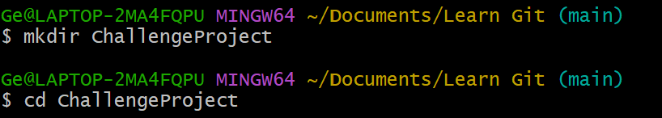
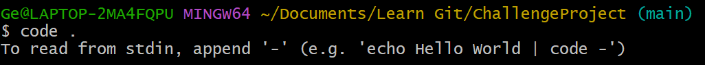
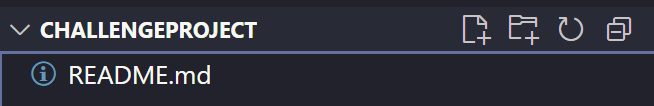
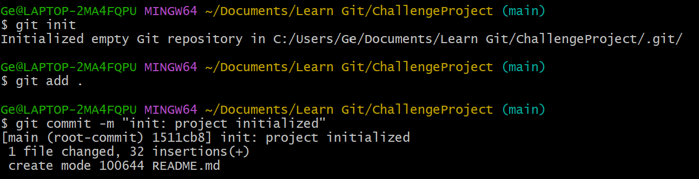

# 🚀 Challenge Project

Repositori ini digunakan untuk latihan Git dasar dan manajemen branch.

---

## 🎯 Langkah Inisialisasi Proyek

### 1. Buat Folder Proyek
```bash
mkdir ChallengeProject
cd ChallengeProject
```

### 2. Buka Folder di Visual Studio Code
```bash
code .
```


### 3. Buat File README.md
```bash
# Challenge Project

Ini adalah repositori latihan Git.
```


### 4. Inisialisasi Git dan Commit Awal
```bash
git init
git add .
git commit -m "init: project initialized"
```


### 5. Buat New Branch
```bash
git branch ParentGe
```

### 6. Setup Remot Repository
- Bikin repo kosong di GitHub (tanpa README)
- Salin URL GitHub
```bash
git remote add origin git@github.com:Nitamayega/Learn-Git-ChallengeProject.git
git push -u origin main
```

### 6. Push ke Branch
```bash
git push origin main
git status -- melihat status perubahan saat ini
```

