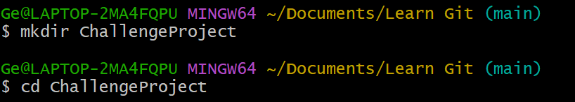
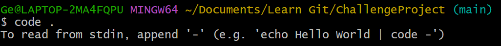
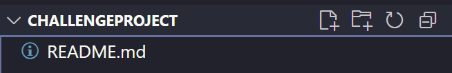
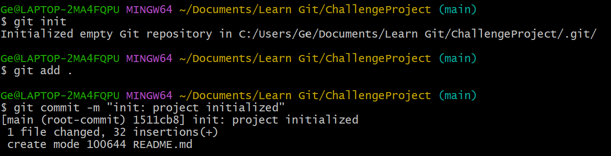

# 🚀 Challenge Project

Repositori ini digunakan untuk latihan Git dasar dan manajemen branch.

---

## 🎯 Langkah Inisialisasi Proyek

### 1. Buat Folder Proyek
```bash
mkdir ChallengeProject
cd ChallengeProject
```


### 2. Buka Folder di Visual Studio Code
```bash
code .
```


### 3. Buat File README.md
```bash
# Challenge Project

Ini adalah repositori latihan Git.
```


### 4. Inisialisasi Git dan Commit Awal
```bash
git init
git add .
git commit -m "init: project initialized"
```
